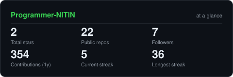
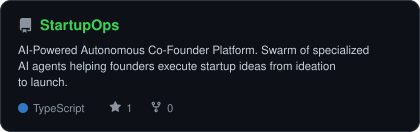
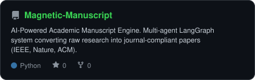
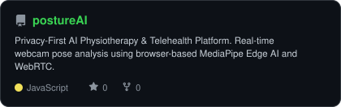
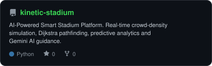

<div align="center">

<!-- PORTRAIT - generated by scripts/dotify.py from assets/jacket.png.
     Colour mode, so one file serves both GitHub themes. Regenerate with:
       python scripts/dotify.py assets/jacket.png -o assets/portrait \
         --cols 100 --equalize --detail 0.5 --color -->


<br>

<!-- NAME / TAGLINE - animated typing -->
<a href="https://github.com/Programmer-NITIN">
  
</a>

<br>

<!-- SOCIALS -->
<a href="https://linkedin.com/in/nitin-patidar-"></a>
<a href="mailto:nitinpatidar9892@gmail.com"></a>
<a href="https://nitinpatidar.vercel.app"></a>
<a href="https://leetcode.com/u/nitinpatidar9892/"></a>
<a href="https://x.com/nitin_patidarr"></a>


</div>

---

## `~/` whoami

```console
$ cat about.txt
```

Hi, I'm **Nitin Patidar**. I'm an AI Developer and Full Stack Engineer obsessed with agentic architectures, real-time AI systems, and interactive 3D web experiences. When I'm not orchestrating autonomous agent swarms or fine-tuning models, you'll find me competing in hackathons or animating in Blender.

- 🚀 Currently building **[StartupOps](https://github.com/Programmer-NITIN/StartupOps)** (autonomous AI co-founder swarm) and **[Magnetic Manuscript](https://github.com/Programmer-NITIN/Magnetic-Manuscript)** (multi-agent academic publishing engine)
- 🌐 Portfolio: **[nitinpatidar.vercel.app](https://nitinpatidar.vercel.app)**
- 🏆 Hackathon track record: **8 competitions · 8 podium finishes (5× 1st, 1× 2nd, 2× 3rd)** — 100% podium rate
- 🎓 B.Tech Computer Engineering (AI & ML specialization) at Silver Oak University
- ⚡ Roles: Full Stack Intern @ Rao Tech AI · Google Gemini Student Ambassador · E-Cell IIT Bombay Campus Ambassador
- 💡 Proof-of-depth: Wrote a **Raft consensus engine in C++20** with deterministic fault-injection simulation at seventeen
- 🎯 Philosophy: *"Build crazy things and serve the world."*

<br>

<div align="center">

## `~/` toolbox


</div>

---

<div align="center">

## `~/` skill radar

<table>
<tr>
<td width="50%" align="center" valign="middle">

<!-- Self-rated radar - edit assets/skills.json, the workflow redraws it -->
<picture>
  <source media="(prefers-color-scheme: dark)"  srcset="assets/radar-dark.svg">
  <source media="(prefers-color-scheme: light)" srcset="assets/radar-light.svg">
  
</picture>

</td>
<td width="50%" align="center" valign="middle">

<!-- Live radar built from real language byte counts across your repos -->
<picture>
  <source media="(prefers-color-scheme: dark)"  srcset="assets/radar-langs-dark.svg">
  <source media="(prefers-color-scheme: light)" srcset="assets/radar-langs-light.svg">
  
</picture>

</td>
</tr>
</table>

</div>

---

<div align="center">

## `~/` contribution calendar

<!-- 3D isometric calendar, regenerated every 6h by .github/workflows/metrics.yml -->


<br><br>

<!-- Retro Space Invaders Contribution Defense - .github/workflows/radar.yml -->


</div>

---

<div align="center">

## `~/` the numbers

<!-- Generated by scripts/cards.py into this repo. Deliberately NOT
     github-readme-stats / streak-stats / github-profile-trophy: those are
     shared public instances that go down and take the whole section with them. -->
<picture>
  <source media="(prefers-color-scheme: dark)"  srcset="assets/card-stats-dark.svg">
  <source media="(prefers-color-scheme: light)" srcset="assets/card-stats-light.svg">
  
</picture>

<br>


<br><br>


</div>

---

<div align="center">

## `~/` selected work

<!-- Cards generated by scripts/cards.py from assets/projects.json.
     Stars, forks and language are pulled live from the API on every run. -->
<table>
<tr>
<td width="50%">
  <a href="https://github.com/Programmer-NITIN/StartupOps">
    <picture>
      <source media="(prefers-color-scheme: dark)"  srcset="assets/card-StartupOps-dark.svg">
      <source media="(prefers-color-scheme: light)" srcset="assets/card-StartupOps-light.svg">
      
    </picture>
  </a>
</td>
<td width="50%">
  <a href="https://github.com/Programmer-NITIN/Magnetic-Manuscript">
    <picture>
      <source media="(prefers-color-scheme: dark)"  srcset="assets/card-Magnetic-Manuscript-dark.svg">
      <source media="(prefers-color-scheme: light)" srcset="assets/card-Magnetic-Manuscript-light.svg">
      
    </picture>
  </a>
</td>
</tr>
<tr>
<td width="50%">
  <a href="https://github.com/Programmer-NITIN/postureAI">
    <picture>
      <source media="(prefers-color-scheme: dark)"  srcset="assets/card-postureAI-dark.svg">
      <source media="(prefers-color-scheme: light)" srcset="assets/card-postureAI-light.svg">
      
    </picture>
  </a>
</td>
<td width="50%">
  <a href="https://github.com/Programmer-NITIN/kinetic-stadium">
    <picture>
      <source media="(prefers-color-scheme: dark)"  srcset="assets/card-kinetic-stadium-dark.svg">
      <source media="(prefers-color-scheme: light)" srcset="assets/card-kinetic-stadium-light.svg">
      
    </picture>
  </a>
</td>
</tr>
</table>

<sub>

| project | live | stack |
|---|---|---|
| **[StartupOps](https://github.com/Programmer-NITIN/StartupOps)** | [startup-ops-phi.vercel.app](https://startup-ops-phi.vercel.app/) | `Next.js` `FastAPI` `LangGraph` `Gemini` |
| **[Magnetic Manuscript](https://github.com/Programmer-NITIN/Magnetic-Manuscript)** | [magnetic-manuscript.vercel.app](https://magnetic-manuscript.vercel.app/) | `React` `FastAPI` `LangGraph` `Groq` |
| **[postureAI](https://github.com/Programmer-NITIN/postureAI)** | [github.com/Programmer-NITIN/postureAI](https://github.com/Programmer-NITIN/postureAI) | `Next.js` `MediaPipe` `WebRTC` `FastAPI` |
| **[kinetic-stadium](https://github.com/Programmer-NITIN/kinetic-stadium)** | [github.com/Programmer-NITIN/kinetic-stadium](https://github.com/Programmer-NITIN/kinetic-stadium) | `FastAPI` `Gemini 2.0` `BigQuery` `Firestore` |

</sub>

</div>

---

<div align="center">

<sub>`01110100 01101000 01100001 01101110 01101011 01110011 00100000 01100110 01101111 01110010 00100000 01110011 01100011 01110010 01101111 01101100 01101100 01101001 01101110 01100111`</sub>

</div>
